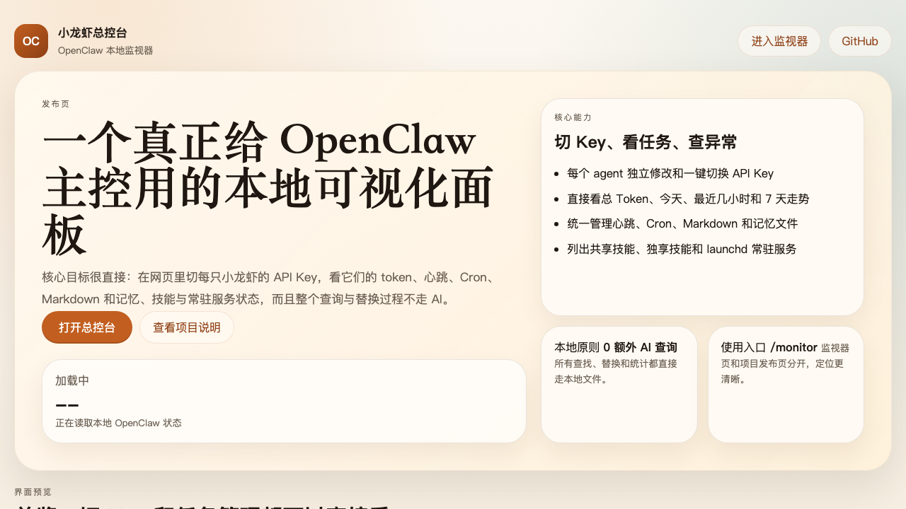

# 小龙虾总控台

一个专门给 OpenClaw 用的本地可视化监视器。

它解决的不是“展示 OpenClaw”，而是“真的在日常主控里盯着它、改它、切它”。

核心原则只有两条：

- 查询、查找、替换、统计都直接读写本地文件和本地服务，不走 AI，不额外耗 token
- 每只小龙虾都能在网页里直接看到 Key、任务、Markdown、技能和运行状态

## 页面截图




## 现在能做什么

- 看整个 OpenClaw 舰队总览
  - 总 token
  - 今天 token
  - 最近 1 小时 / 3 小时 / 6 小时 / 24 小时 / 7 天 token
  - 近 24 小时和近 7 天走势
- 看每只小龙虾的运行状态
  - 活跃 / 空闲 / 异常 / 离线
  - 最后活动时间
  - 最后一次请求是什么
  - 最近请求时间线
- 管理每个 agent 的模型 provider
  - 直接改 `apiKey`
  - 直接改 `baseUrl`
  - 默认隐藏真实 key，按需显示
- 管理 API Key 预设池
  - 保存为本地预设
  - 从当前通道抓一份配置做成预设
  - 一键套给当前小龙虾
  - 一键套给所有同名通道
- 管理长期任务
  - heartbeat 开关、间隔、提示词、目标
  - Cron 开关
  - 直接编辑 Cron 原始 JSON
  - 看最近运行摘要、token 和失败状态
- 管理 Markdown 和记忆文件
  - 列出每只小龙虾 workspace 下的所有 `.md`
  - 直接网页编辑
  - 本地查找 / 替换，不调用模型
- 看技能分布
  - 全局共享 skill
  - 当前 agent 独享 skill
  - 当前实际生效 skill
- 看系统层运行状态
  - `ai.openclaw.*` launchd 常驻服务
  - 网关状态
  - 简单告警中心

## 页面结构

- `/`
  - 正式项目入口页
  - 更像发布页 / 首页
  - 说明这是什么、能做什么、当前这台机器的大盘状态
- `/monitor`
  - 真正的总控操作页
  - 所有管理动作都在这里完成

默认地址：

```text
http://127.0.0.1:3199
```

监视器页：

```text
http://127.0.0.1:3199/monitor
```

## 设计目标

### 1. 真正可主控

不是只看日志，也不是只看某一个 agent，而是把整个 OpenClaw 当作一套本地系统来控制。

### 2. 不额外耗 token

所有监控、搜索、替换、统计都直接走本地：

- 本地 JSON
- 本地 JSONL
- 本地 Markdown
- 本地 launchd
- 本地日志

### 3. 不改 OpenClaw 核心链路

这个项目不接管 OpenClaw 的核心执行逻辑，只做旁路可视化和配置落地。

## 数据来源

页面数据直接聚合自这些本机位置：

- `~/.openclaw/openclaw.json`
- `~/.openclaw/agents/*/sessions/*.jsonl`
- `~/.openclaw/agents/*/sessions/sessions.json`
- `~/.openclaw/cron/jobs.json`
- `~/.openclaw/cron/runs/*.jsonl`
- `~/.openclaw/logs/gateway.log`
- `~/Library/LaunchAgents/ai.openclaw*.plist`
- 各 agent 的 `workspace/**/*.md`
- `~/.openclaw/skills`

本地扩展状态会写到：

- `data/monitor-state.json`

这个文件用于保存：

- heartbeat 开关辅助状态
- API Key 预设池

它已经被 `.gitignore` 忽略，不会进仓库。

## 本地运行

```bash
cd /Users/huxy/Documents/Playground
npm run start
```

开发模式：

```bash
npm run dev
```

## 项目结构

```text
.
├── server.mjs
├── lib/
│   ├── monitor-common.mjs
│   ├── monitor-data.mjs
│   └── monitor-actions.mjs
├── public/
│   ├── index.html
│   ├── monitor.html
│   ├── landing.js
│   ├── app.js
│   ├── styles.css
│   └── assets/screenshots/
└── README.md
```

## 已知取舍

- Cron 编辑现在仍然是“原始 JSON 直接改”，还没有表单化编辑器
- 告警是本地规则推断，不是独立告警服务
- launchd 开关会直接影响本机 OpenClaw 服务，操作立即生效
- 这是本地单机工具，不做多用户权限隔离

## 适合继续补的方向

- 更完整的 preset 批量分组策略
- 可视化 Cron 编辑器
- 按 agent 的更细粒度成本统计
- 会话搜索、过滤和导出
- 更正式的异常通知和 webhook 告警
